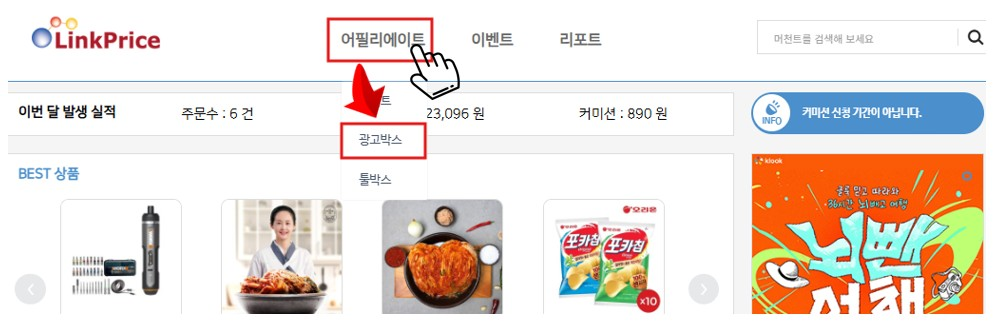
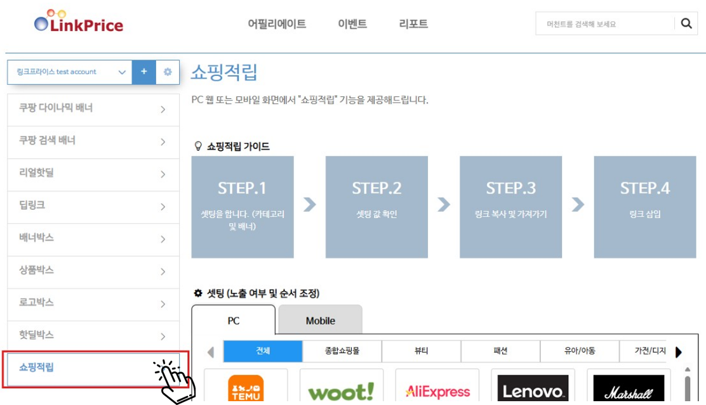
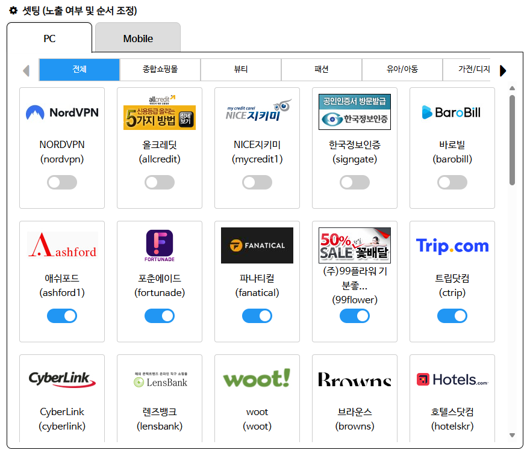
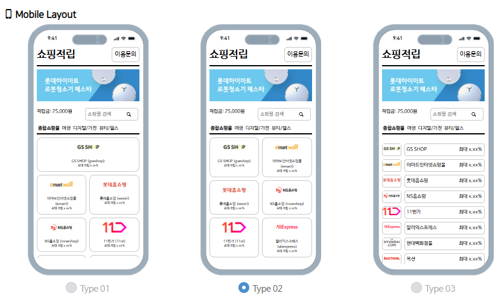
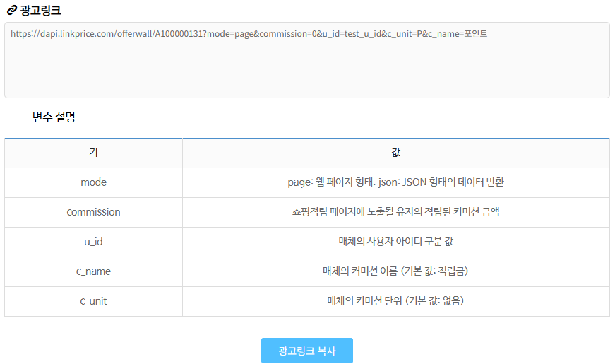
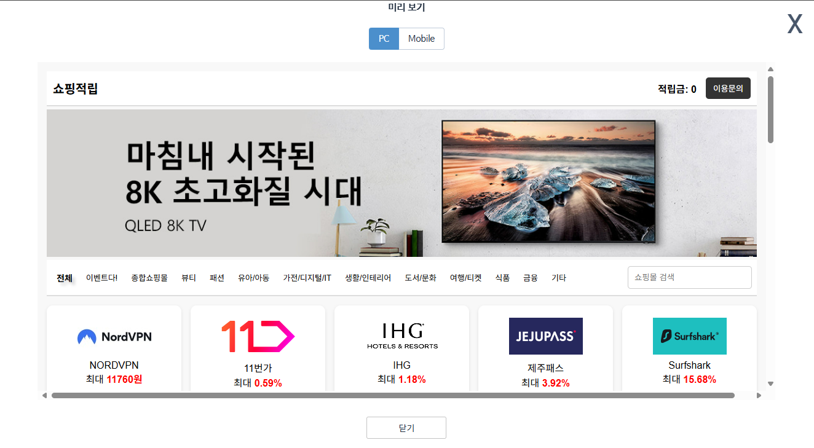
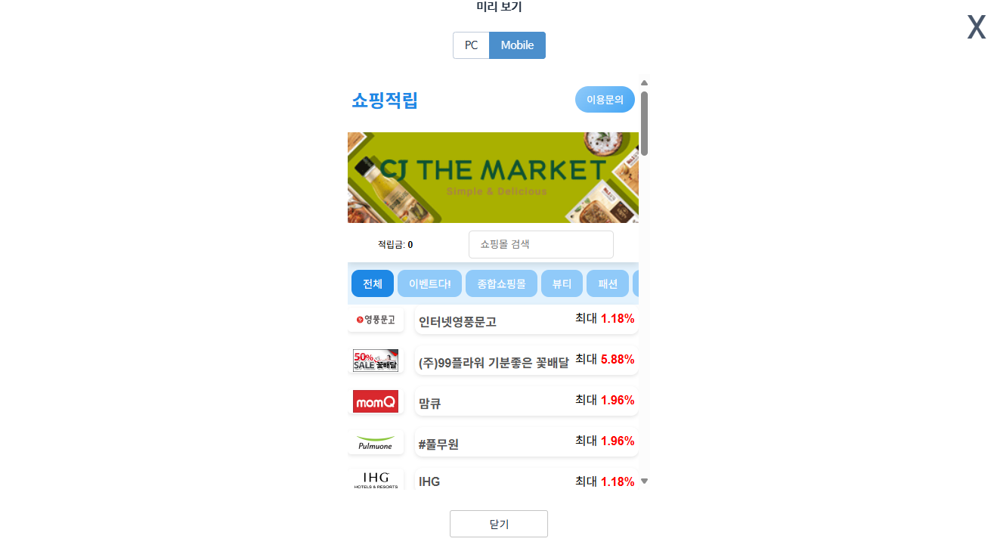

# 쇼핑적립 운영 가이드
## 문서 이력

|     날짜     | 버전  | 내용                                    | 작성자 |
|:----------:|:---:|:--------------------------------------|:---:|
| 2025-03-28 | 0.1 | 최초 작성                                 | 김민제 |
| 2025-03-31 | 0.2 | 파라미터 길이 추가                            | 김민제 |
| 2025-04-02 | 0.3 | 적립금 관련 파라미터 추가, 가이드 문구 수정,  응답 데이터 추가 | 김민제 |
| 2025-05-16 | 0.4 | 불필요한 응답 데이터 제거. 쇼핑적립 메인 구성 변경         | 김민제 |
| 2025-06-02 | 0.5 | 머천트 상세정보 응답 값 수정                      | 김민제 |
| 2025-06-02 | 0.6 | 어필리에이트 센터 이동 링크 삽입                    | 최훈필 |
| 2025-06-02 | 0.7 | 명칭 수정(쇼핑적립)                           | 최훈필 |
| 2025-06-04 | 0.8 | 스크린샷 변경 및 위치 수정                       | 김민제 |
| 2025-06-04 | 0.9 | 연동가이드와 운영가이드 분리                       | 김민제 |
| 2025-06-05 | 1.0 | 최종 확인 및 검수 완료 (ver1.0)                | 최훈필 |
## "쇼핑적립" 이란?

링크프라이스에서 "쇼핑적립" 페이지를 제공해 주는 기능입니다. 사용자는 "쇼핑적립" 기능을 위한 별도 페이지 및 시스템 개발 없이도 웹뷰 형태로 노출 시키기만 해도 "쇼핑적립" 기능을 이용할 수 있습니다.
링크프라이스에서 허용한 매체에 한해 사용 가능합니다.

"쇼핑적립"은 4개의 페이지로 이루어져 있습니다.

1. 쇼핑적립 메인
	매체에서 지정한 카테고리별 머천트 목록 순서를 노출합니다.
	머천트별 검색 기능을 제공하며, 머천트 또는 배너 클릭 시 해당 머천트 화면으로 이동합니다.
2. 머천트 상세 정보
	각 머천트 별 최대 적립율, 적립 시점, 적립 제외 카테고리, 유의 사항 등의 내용이 존재하며, 버튼 클릭 시 제휴링크를 통해 각 머천트 메인 페이지로 이동합니다.
3. 이용 문의
	링크프라이스에서 작성한 쇼핑 적립 이용 가이드를 조회 할 수 있으며, FAQ를 통해 궁금한 점을 해소 할 수 있습니다. 
4. 누락 문의
	구매가 정상적으로 이루어졌으나 적립금에 금액이 노출 되지 않는 경우 매체 이용자가 직접 링크프라이스에 문의할 수 있습니다. 링크프라이스에서는 문의 내용을 확인하여 매체 이용자 메일로 답변을 발송 할 수 있습니다. 

## "쇼핑 적립" 설정 가이드
어필리에이트 센터(https://ac.linkprice.net/)를 이용하여 설정합니다.
1. 링크프라이스 어필리에이트 센터(https://ac.linkprice.net/)에 접속 합니다.
2. "어필리에이트" 메뉴 마우스 호버 시 하단에 나오는 "광고박스" 메뉴를 선택합니다.
	

3. 좌측 메뉴에서 "쇼핑적립" 메뉴를 클릭합니다.
	

4. "쇼핑적립" 노출 머천트 셋팅 화면입니다. 
   각 머천트 별 카드를 드래그하여 순서를 조정할 수 있고, 하단 부의 토글 버튼으로 머천트 노출 여부를 지정할 수 있습니다. 
   특정 카테고리 내부에 노출 설정되는 머천트가 존재하지 않는 경우, 해당 카테고리는 쇼핑적립 메인 페이지에 노출되지 않습니다.
   

   ※ 링크프라이스 또는 머천트 내부 사정으로 인해 일시적 장애 발생 또는 승인 거부 등의 이슈 발생 시 사용자의 설정과 무관하게 특정 머천트가 노출되지 않을 수 있습니다.

5. 모바일 레이아웃 설정 화면입니다.
   모바일 화면의 경우 총 3개의 타입이 제공됩니다.
	1. 최상단 머천트에 대해 주력 홍보를 위한 강조형 타입
	2. 1줄에 2개의 머천트를 노출하는 규칙형 타입.
	3. 한 페이지 내 가장 많은 머천트를 노출 하는 목록형 타입

    

6. 광고링크 항목입니다. 
   연동 시 필요한 파라미터에 설명이 첨부되어 있으며, \[광고링크\] 복사 버튼 클릭 시 광고 링크가 클립보드로 복사 됩니다.
   

7. \[미리보기\] 버튼 클릭 시 저장된 형태에 대해 확인 가능합니다.
	
	
